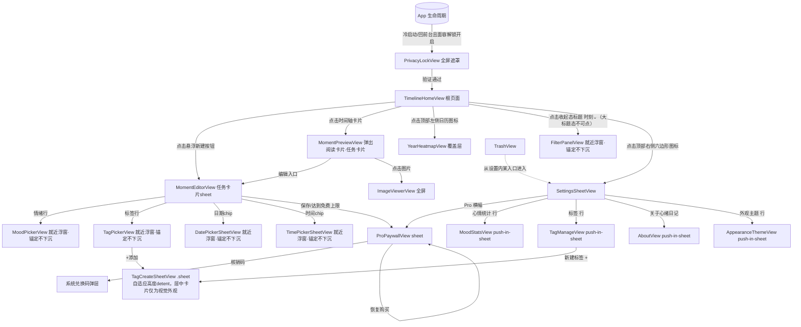

# 信息架构与导航

> 职责说明：定义 App 的单页信息架构与真机导航图，明确各页面的层级关系与呈现（presentation）机制。

## 单页信息架构

根体验只有一个一级页面 **Home Timeline「时刻」**，不存在并列 Tab；新建、预览、筛选、热力图、设置都从 Home Timeline 展开为临时上下文任务，任务完成后回到时间轴 `[真机确认 + 观测确认]`。

```text
Home Timeline（唯一一级页面）
├── 顶部左：日历方块图标 → 年度心情热力图（覆盖层，非独立一级页）
├── 顶部中：标题「时刻」→ 滚到顶为大标题(纯场景标识,不可点)；上滑折叠为收起态「时刻 ⌄」，收起态才是标签/心情筛选入口
├── 顶部右：六边形图标 → 设置 sheet
│     ├── Pro 订阅（含核销码 / 恢复购买）
│     ├── 心情统计
│     ├── 标签管理
│     ├── 垃圾箱
│     ├── iCloud 数据同步
│     ├── 面容解锁
│     ├── 语言
│     ├── 外观主题
│     └── 关于「心绪日记」
├── 底部中央：悬浮新建按钮 → 新建 Moment（sheet）
└── 时间轴卡片 → 单条 Moment 预览 → 编辑 Moment / 图片查看器
```

首次使用或时间轴为空时，不做独立 Onboarding 页，而是在时间轴内以 3 条不可删除/不可编辑的**预置引导 Moment**（「马上创建」「什么是时刻?」「欢迎来到时刻~」）承担引导职责 `[真机确认]`。这些引导条目工程上不落库为真实 `Moment` 记录（不计入免费额度、不参与 iCloud 同步），而是本地静态数据在 `TimelineHomeView` 中与真实数据合并展示，用户产生第一条真实记录后不再展示 `[设计决策]`。

## 真机导航图



导航方式说明（功能行为已在真机确认；呈现机制已在生产就绪评审中定稿，并据 `product-mental-model.md` 公理 4 区分两类浮层层级；统一规范与 View→机制映射表见《08-architecture.md》第 2 节，选型理由见《14-design-decisions.md》ADR-003/006/007）：
- **两类本质不同的浮层层级（公理 4）**：**任务卡片栈**（承接完整任务：新建/编辑、单条预览、设置及子页、Pro 权益、新建标签）用系统 `.sheet`（page sheet），**背景下沉、上一层缩小、进入层级栈**，由集中 `AppRouter` 的 `.sheet(item:)` 驱动；`MomentEditorView`、`SettingsSheetView`、`ProPaywallView` 各自内含独立 `NavigationStack` 承载「取消/保存」「‹设置返回」顶栏 `[真机确认交互 + 设计决策呈现]`。
- **卡片层叠下沉是系统默认行为**：sheet 之上再 present sheet（如 编辑器→Paywall、设置子页→新建标签），系统自动令底层卡片下沉缩小变暗、逐层关闭逐层浮回，不手写动画、不引第三方库（业界称 Stacked Sheets / Cascading Page Sheets）`[设计决策]`。
- `MomentPreviewView` = **弹出的阅读卡片（任务卡片，进卡片栈），不是 push 页面跳转**；关闭回到时间轴原滚动位置 `[观测确认]`（无独立截图，据公理产品逻辑推导，见 ADR-007）。`TrashView` 已定：挂设置「分组卡片 A」，与「标签」同级。
- `YearHeatmapView` 是 `TimelineHomeView` 之上的覆盖层（ZStack overlay，非模态、非 sheet），背景半透明，X 收起并保留时间轴状态 `[真机确认 + 设计决策呈现机制]`。
- `FilterPanelView`、`MoodPickerView`、`TagPickerView`、`DatePickerSheetView`、`TimePickerSheetView` 这类"就地选择一个条件或值"的短动作：统一为**就近浮窗**——**锚定触发元素、带指向尖角、尺寸自适应、背景不下沉、不缩小、不进层级栈**；**跨设备都保持锚定浮窗形态，iPhone 不降级为下沉的半高 sheet** `[真机确认交互 + 观测确认 + 设计决策呈现，见 14-design-decisions.md ADR-006]`。
- `ImageViewerView` 用 `.fullScreenCover`（沉浸全屏、无层叠语义）；`PrivacyLockView` 是应用级全屏遮罩，无法手势关闭，详见《10-security-privacy.md》。

**上下文标记（当前查看条件的可见表达）**：时间轴顶部可并存两类互不相同的标记，分别可移除、含义不同（依 `product-mental-model.md` 上下文标记对象与公理 2）——
- **筛选标记**（`#标签` / 情绪 emoji + 名称）：说明"当前只看满足条件的时刻"；移除它改变的是**看哪些记录**（内容集合），来自筛选浮窗。
- **时间标记**（年 / 月 / 日）：说明"当前定位到某个时间点"；移除它改变的是**是否停在某个时间位置**（滚动锚点），来自热力图定位。
- 二者正交、可同时存在、各自独立移除，工程上对应 `activeFilter` 与 `heatmapFocusDate` 两个独立状态源（见《08-architecture.md》§4.2）`[设计决策]`。
