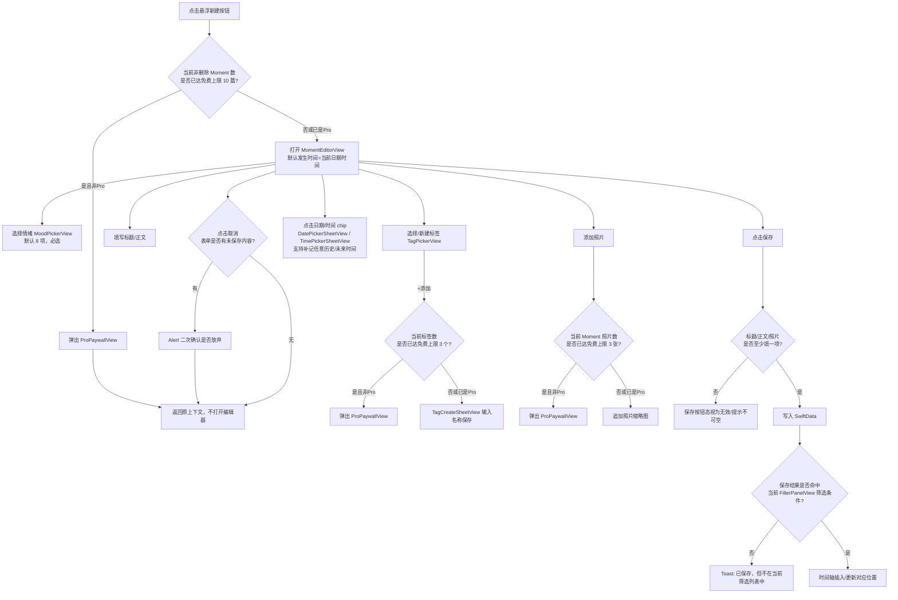
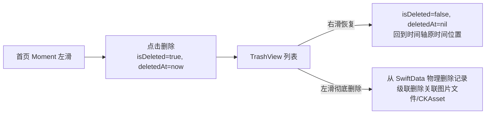

# 核心用户流程

> 职责说明：描述记录、时间轴浏览、热力图定位与筛选的区分、删除/垃圾箱、订阅升级等核心用户流程的完整路径与关键要点。

## 3.1 记录 Moment 全流程

要点补充（均为对事实基线的流程化展开，非新增事实）：
- 情绪为必选项，`MomentEditorView` 默认展示的情绪按回退规则确定：有历史选择则用上次选择，否则回退到 `Mood.normal`；工程上不允许保存无情绪的 Moment `[真机确认 + 设计决策]`。
- 标题/正文/照片「至少填一项」才有保存意义；照片、标题、正文都为空时保存按钮应处于禁用态，而不是保存后产生空记录 `[观测确认]`。
- 关闭未保存表单需二次确认，形式为系统 `Alert`，两个按钮「放弃编辑 / 继续编辑」（《13-open-questions.md》已裁决） `[观测确认 + 设计决策]`。
- 保存后不在当前筛选结果内的反馈用非阻断式 Toast/Banner，不打断用户返回时间轴的路径 `[观测确认]`。
- 发生时间 `occurredAt` 完全独立于系统写入时间，编辑器默认预填「现在」，但用户可任意改成过去或未来日期以支持补记 `[观测确认]`。

## 3.2 时间轴浏览

- 首屏按 `occurredAt` 倒序（最新在上）连续展开为聊天气泡式时间轴，左列时间戳+心情节点圆点（节点**按该条情绪的心情色**着色，每情绪一色，见《05-design-system.md》），右列标题+正文摘要（约 3 行截断）+ 图片缩略图 `[真机确认]`。
- 点击卡片 → **弹出 `MomentPreviewView` 阅读卡片**（在时间轴之上浮起、进入任务卡片栈，非页面 push），顶部保留心情、日期、编辑入口，正文区展示标题/标签/照片/正文全文；点击图片进入 `ImageViewerView`；关闭阅读卡片回到时间轴 `[观测确认]`。
- 左滑卡片露出删除动作，点击后 Moment 立即软删除进入垃圾箱，**不弹二次确认弹窗**（因为垃圾箱本身即恢复安全网）`[观测确认]`。

## 3.3 热力图定位 vs 标签/心情筛选（关键区分，不可混淆实现）

| 维度 | 年度心情热力图（`YearHeatmapView`） | 标签/心情筛选（`FilterPanelView`） |
| --- | --- | --- |
| 触发入口 | 首页顶部左侧日历图标 | 首页顶部**收起态**标题「时刻 ⌄」（大标题展开态不可点） |
| 操作对象 | 选择年份 → 选择某月/某有记录日期 | 选择**多个标签（彼此 AND 交集）+ 至多一个心情（单选）**；标签与心情之间也 AND（见《04-screen-specs.md》4.2 筛选组合逻辑） |
| 对时间轴的影响 | **不改变可见数据集合**，只是把时间轴滚动定位到对应时间段并高亮该列 `[真机确认 + 观测确认]` | **改变可见数据集合**，只展示命中条件的 Moment，并在首页顶部显示条件横条（如「相关标签 #工作」+ X）`[真机确认]` |
| 取消方式 | 再次点击同一锚点取消定位；点右上 X 关闭覆盖层 `[观测确认]` | 点条件横条上的 X 单独移除该条件，或整体清除 `[真机确认]` |
| 是否可叠加 | 定位与筛选可同时存在（先筛选后定位，或先定位后筛选），二者互不覆盖，因为一个改数据源、一个改滚动位置 `[设计决策]` | 同上 |
| 空状态 | 「这些天没有日记哦」+ 插画 `[真机确认]` | 筛选后 0 条命中时，时间轴区域展示对应空态文案（样式沿用同一套空态组件）`[设计决策]` |

工程实现上二者必须是两个独立状态源：`heatmapFocusDate: Date?`（只影响 `ScrollViewReader` 的滚动目标）与 `activeFilter: FilterCondition?`（只影响 `@Query` 的谓词），严禁合并成同一个状态变量，否则会破坏「定位≠筛选」的产品语义 `[观测确认]`。

## 3.4 删除 → 垃圾箱 → 恢复/彻底删除

- 首页删除不二次确认；垃圾箱内的彻底删除才是不可逆操作，视为用户「放弃恢复」 `[观测确认]`。
- 恢复后的 Moment 按其原 `occurredAt` 重新出现在时间轴对应位置，而不是出现在恢复操作发生的时间点 `[观测确认]`。
- 垃圾箱内的 Moment **计入免费 10 篇上限**（已裁决）：软删除不释放配额，用户必须在垃圾箱内**彻底删除**才腾出名额，避免用「删除进垃圾箱」绕过 10 篇限制。
- 标签删除走独立生命周期，不进入垃圾箱、不可恢复，只解除标签与 Moment 的关联关系，见《07-data-persistence.md》 `[观测确认]`。

## 3.5 订阅升级 / 核销码 / 恢复购买

- **触发原则**：Paywall（`ProPaywallView`）只有两类触发来源——① 用户主动从设置页 Pro 横幅点击进入（非阻断）；② 用户在记录流程中触达免费限额（新建第 11 篇 Moment / 第 4 张照片 / 第 4 个标签）时以阻断式上下文提示出现，此时保存/添加动作会被拦截直到用户购买或退出 `[观测确认]`。限额数值本身以《06-domain-model.md》为准，本节不重复定义。
- **购买流程**：`ProPaywallView` 同时展示两个方案——「月订阅」（auto-renewable subscription，¥6/月）与「终身买断」（non-consumable IAP），用户二选一（价格均按 `Product.displayPrice` 动态取值而非写死文本，因不同 App Store 地区定价不同 `[设计决策]`）→ 点击「解锁所有功能」对选中商品 `Product.purchase()` → 校验 `VerificationResult` → `transaction.finish()`（月订阅与终身买断的 entitlement 均进入 `Transaction.currentEntitlements`，二者 OR 关系任一有效即 Pro）→ 刷新本地 `SubscriptionStateCache` → 关闭 Paywall 回到触发前的原上下文（新建流程继续、或设置页刷新为 Pro 态）。与《11-monetization.md》一致。
- **核销码**：仅当平台为 iOS 且系统兑换码能力可用时展示「核销码」入口 `[观测确认]`；点击后调起系统兑换码弹层，成功兑换后不需要额外网络请求确认，靠 `Transaction.updates` 异步流被动收到新的 entitlement 并刷新 Pro 状态。
- **恢复购买**：Paywall 底部红色「恢复购买」→ 触发 App Store 账户凭证同步 → 重新拉取 `Transaction.currentEntitlements` → 命中则刷新为 Pro 态并给出成功反馈，未命中给出「未找到可恢复的购买记录」提示。
- 三个入口（横幅/限额拦截/恢复购买）UI 呈现完全一致（同一个 `ProPaywallView`），只是「关闭后回到哪里」不同，符合「不被带离原语境」的整体交互语言 `[观测确认]`。
